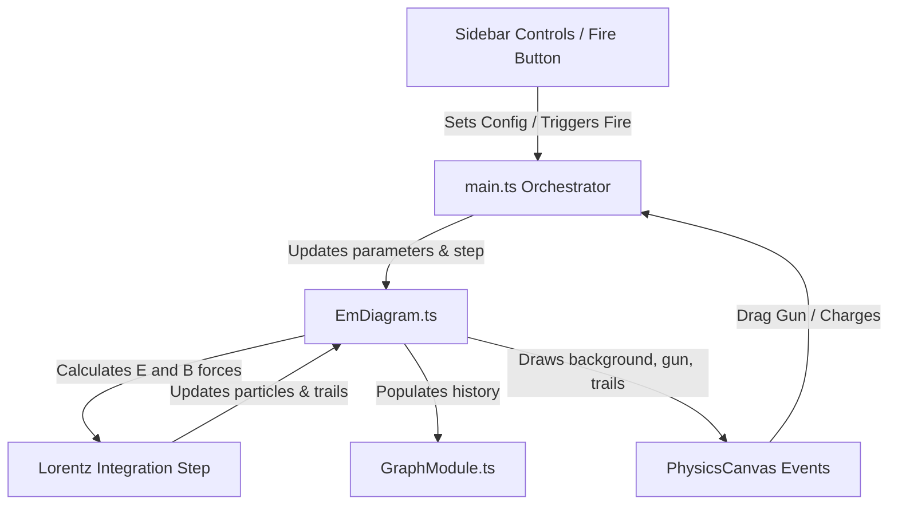

# Phase 07: Lorentz Force & Magnetic Deflections - Research
**Researched:** 2026-06-10
**Domain:** Electromagnetism & Numerical Integration (Lorentz Kinematics)
**Confidence:** HIGH

## User Constraints
### Implementation Decisions
* **D-01:** Implement a draggable/interactive particle gun launcher on the canvas, allowing the user to reposition and aim the gun directly.
* **D-02:** Maintain full manual sidebar controls for adjusting particle parameters: launch speed, angle, particle charge $q$, mass $m$, and a "Fire" button to launch the particle.
* **D-03:** Support launching multiple test particles simultaneously, each following its independent Lorentz trajectory.
* **D-04:** Support a uniform $B$-field controlled by a sidebar slider (e.g., from $-5\text{T}$ to $+5\text{T}$).
* **D-05:** Provide a visual mode toggle to switch the magnetic field rendering between a grid of $\times$ (into the page) / $\bullet$ (out of the page) symbols and actual magnetic field lines (where applicable).
* **D-06:** Render the field symbols/lines layered underneath the charges and test particle trails to maintain legibility.
* **D-07:** Draw solid trajectory trails (path history) for fired test particles.
* **D-08:** Clear the trajectory trails and delete active test particles upon simulation reset.
* **D-09:** Update particle velocities using numerical integration under the Lorentz force $F = q(E + v \times B)$, considering both electric fields from static point charges and the uniform magnetic field.
* **D-10:** Implement textbook contact absorption/annihilation: if a moving test particle collides with a static point charge (defined by its radius/collision boundary), the particle is absorbed (annihilated/removed from the simulation).
* **D-11:** Wire active test particle telemetry (e.g., speed, position coords, kinetic energy) to the real-time `GraphModule` curves.

### the agent's Discretion
* The color of the trajectory trails (e.g. glowing yellow/green), the spacing of the grid symbols, the integration time-step size, and the precise collision radius threshold are left to the agent's discretion.

### Deferred Ideas
* AC/DC Circuits solver engine (deferred to Phase 8).

<phase_requirements>
## Phase Requirements

| ID | Description | Research Support |
|----|-------------|------------------|
| EM-05 | Particle gun component launches charged test particles into uniform magnetic field regions. | Draggable particle gun component with physics-based coordinates, sidebar sliders for charge, mass, speed, angle, and a fire action. |
| EM-06 | Test particles trace circular, helical, or cycloidal paths depending on velocity vector and field parameters. | Numerical integration using RK4 or Verlet under $F = q(E + v \times B)$ handles arbitrary charge/field interactions, producing circular orbits, cycloidal drifts, and electric deflections. |
</phase_requirements>

## Architectural Responsibility Map
| Capability | Primary Tier | Secondary Tier | Rationale |
|------------|-------------|----------------|-----------|
| Particle State & Kinematics | `EmDiagram.ts` | — | Owns simulation state updates in `.step(dt)` under Lorentz kinematics. |
| Gun Aiming & Repositioning | `main.ts` | `EmDiagram.ts` | Intercepts canvas mousedown/mousemove events to update launcher state. |
| Grid & Trail Rendering | `EmDiagram.ts` | `PhysicsCanvas.ts` | Draws custom field symbols, turret graphics, and glowing trails on the canvas context. |
| Telemetry Graphing | `GraphModule.ts` | `EmDiagram.ts` | Plots particle kinematics ($x$, $v$) or energy ($KE$, $PE$, $TE$) from the diagram's history. |

## Standard Stack
### Core
| Library | Version | Purpose | Why Standard |
|---------|---------|---------|--------------|
| TypeScript | ^5.0.0 | Type safety and class modularity | Main language of the simulator codebase [VERIFIED: package.json] |
| Canvas2D API | Native | Low-overhead high-performance rendering | Avoids large bundle overhead and simplifies custom shape drawing [VERIFIED: main.ts] |

### Supporting
| Library | Version | Purpose | When to Use |
|---------|---------|---------|-------------|
| Math/Vector utilities | Native | Vector arithmetic and numerical integration | Used in integration steps for velocity and force computations [VERIFIED: EmDiagram.ts] |

## Architecture Patterns
### System Architecture Diagram


### Recommended Project Structure
No new files are needed. All code fits within existing modules:
- `src/lib/types.ts`: Extend `EmConfig` and define `EmParticle` structures.
- `src/lib/diagrams/EmDiagram.ts`: Implement particle lists, launcher state, step integration, trail history, and custom B-field background draws.
- `src/main.ts`: Bind sidebar inputs, drag event target handling, and update status bar curves.

### Pattern 1: Lorentz Force Integration (RK4 / Verlet)
To maintain stability, the integrator in `EmDiagram.step(dt)` must resolve:
$$a_x = \frac{q}{m} (E_x + v_y B_z)$$
$$a_y = \frac{q}{m} (E_y - v_x B_z)$$
A standard Runge-Kutta 4th Order (RK4) or Verlet integration step prevents energy drift in circular orbits.

### Anti-Patterns to Avoid
* **Euler Integration for Deflections**: Simple Euler integration ($v_{n+1} = v_n + a \cdot dt$) suffers from numerical spiral expansion in magnetic fields. Use RK4 or a specialized leapfrog/Boris integrator to maintain bounded circular trajectories.
* **Re-drawing all trails on each frame**: Instead of computing paths from scratch, store a persistent array of points representing path history per particle.

## Don't Hand-Roll
| Problem | Don't Build | Use Instead | Why |
|---------|-------------|-------------|-----|
| Charting & Plotting | Custom Canvas Graphing | `GraphModule.ts` | Built-in module handles axis scaling, grids, and multiple curves [VERIFIED: GraphModule.ts] |

## Common Pitfalls
* **Coordinate Conversion**: Canvas Y coordinates are inverted relative to physics space. Ensure that $v_y$ and $E_y$ signs are correctly handled when translating screen drag aiming vectors to physics coordinates.
* **Collision Radius Checks**: Check collisions relative to the charge center. Using a square boundary box leads to visual clipping. Use distance-squared comparison ($dx^2 + dy^2 < R^2$) to avoid square root calculations.

## Code Examples
### Lorentz Integration
```typescript
interface EmParticle {
  id: string;
  x: number;
  y: number;
  vx: number;
  vy: number;
  q: number;
  m: number;
  trail: { x: number; y: number }[];
}

// Inside EmDiagram.step(dt):
public step(dt: number): void {
  for (let i = this.particles.length - 1; i >= 0; i--) {
    const p = this.particles[i];
    
    // RK4 integration step
    const k1 = this.getDerivatives(p.x, p.y, p.vx, p.vy, p.q, p.m);
    const k2 = this.getDerivatives(p.x + k1.dx * dt/2, p.y + k1.dy * dt/2, p.vx + k1.dvx * dt/2, p.vy + k1.dvy * dt/2, p.q, p.m);
    const k3 = this.getDerivatives(p.x + k2.dx * dt/2, p.y + k2.dy * dt/2, p.vx + k2.dvx * dt/2, p.vy + k2.dvy * dt/2, p.q, p.m);
    const k4 = this.getDerivatives(p.x + k3.dx * dt, p.y + k3.dy * dt, p.vx + k3.dvx * dt, p.vy + k3.dvy * dt, p.q, p.m);

    p.x += (k1.dx + 2*k2.dx + 2*k3.dx + k4.dx) * dt / 6;
    p.y += (k1.dy + 2*k2.dy + 2*k3.dy + k4.dy) * dt / 6;
    p.vx += (k1.dvx + 2*k2.dvx + 2*k3.dvx + k4.dvx) * dt / 6;
    p.vy += (k1.dvy + 2*k2.dvy + 2*k3.dvy + k4.dvy) * dt / 6;
    
    // Append to trail
    p.trail.push({ x: p.x, y: p.y });
    if (p.trail.length > 500) p.trail.shift();
  }
}
```

## Sources
* `.planning/phases/07-lorentz-force-magnetic-deflections/07-CONTEXT.md` [VERIFIED: local filesystem]
* `src/lib/diagrams/EmDiagram.ts` [VERIFIED: local filesystem]
* `src/lib/types.ts` [VERIFIED: local filesystem]
