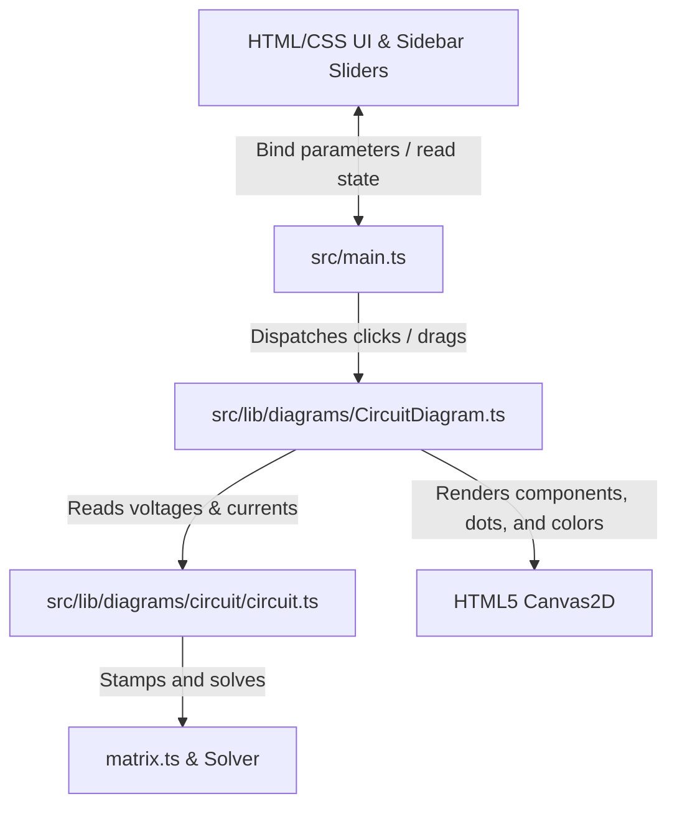

# Phase 9: Schematic Breadboard Canvas UI & Parameter Bindings - Research
**Researched:** 2026-06-11
**Domain:** HTML5 Canvas2D rendering, Interactive Circuit Schematics, Real-Time MNA Solver bindings
**Confidence:** HIGH

## Summary
To build a highly responsive and interactive schematic breadboard visualizer, we will port the component rendering routines from `scratch/circuitjs/` to a new `CircuitDiagram.ts` module. The diagram will render wires, resistors, capacitors, inductors, batteries (voltage sources), and switches. Crucially, the canvas rendering loop will draw dynamic voltage potentials on nodes/wires using a color gradient (green/gray for 0V, fading to bright red for positive voltage, and fading to bright blue for negative voltage) and animate moving current flow dots along wires and elements at a speed proportional to current magnitude.

We will integrate canvas click and drag gestures. A direct hit-test on a switch component will toggle its open/closed state and trigger immediate topological parsing and solver matrix recalculations. A click on a parameter-based component (e.g. resistors, capacitors) will select it, highlighting it on the canvas and dynamically updating the sidebar panel with sliders to adjust its parameters in real-time.

**Primary recommendation:** Build a self-contained `CircuitDiagram` class at `src/lib/diagrams/CircuitDiagram.ts` extending the coordinate mapping and layout structure of the other simulator diagrams, and extend `src/main.ts`'s input dispatcher to coordinate component selection, switch toggling, and sidebar slider bindings.

---

## User Constraints

### Implementation Decisions (from CONTEXT.md)
* **D-01:** Port drawing routines from `scratch/circuitjs/circuit-sim/src/renderer/element-renderers.ts` and house them directly in a new self-contained rendering class `CircuitDiagram` at `src/lib/diagrams/CircuitDiagram.ts`. `[VERIFIED: scratch/circuitjs/circuit-sim/src/renderer/element-renderers.ts]`
* **D-02:** Use the standard dynamic voltage coloring scheme from `scratch/circuitjs/circuit-sim/src/renderer/voltage-colors.ts` (wires and components colored green/gray for 0V/ground, fading to bright red for positive potentials, and fading to bright blue for negative potentials). `[VERIFIED: scratch/circuitjs/circuit-sim/src/renderer/voltage-colors.ts]`
* **D-03:** Port the moving current flow dots algorithm from `scratch/circuitjs/circuit-sim/src/renderer/current-dots.ts`. Animate the dots along wires and components at a speed proportional to the computed current magnitude and direction matching the current flow. `[VERIFIED: scratch/circuitjs/circuit-sim/src/renderer/current-dots.ts]`
* **D-04:** Allow users to click switches directly on the canvas to toggle their open/closed state, triggering immediate topological parsing and solver matrix recalculations. `[ASSUMED]`
* **D-05:** Implement component selection on click. When a component (e.g. resistor, capacitor, inductor, voltage source) is selected, highlight it visually on the canvas and dynamically bind its parameter values (e.g. resistance, capacitance) to the sidebar control sliders for real-time adjustments. `[ASSUMED]`

### the agent's Discretion
* Canvas highlighting styles for selected components.
* Default scaling factors and grid margins on the breadboard display.
* Visual speeds and densities of animated current flow dots.

### Deferred Ideas
* Full component toolbox drawer to add/remove components dynamically (deferred to future backlog; current focus is on preset configurations interaction).

---

<phase_requirements>
## Phase Requirements

| ID | Description | Research Support |
|----|-------------|------------------|
| EM-08 | Solver supports interactive switch component clicks to open/close loops. | Section **Interaction & Hit-Testing** and **Code Examples** detail click handling, toggling `closed` state on the `SwitchElement`, and calling `circuitEngine.analyzeCircuit()` to refresh matrix equations. |
</phase_requirements>

---

## Architectural Responsibility Map

| Capability | Primary Tier | Secondary Tier | Rationale |
|------------|-------------|----------------|-----------|
| Schematic Rendering | `CircuitDiagram` | `element-renderers` | Draws standard schematic symbols on the main physics canvas with custom thematic styling. |
| Voltage Color mapping | `CircuitDiagram` | — | Maps node voltages to a linear red-gray-blue gradient. |
| Current Flow Animation | `CircuitDiagram` | `current-dots` | animates moving dots proportional to element current using requestAnimationFrame timestamp. |
| Pointer Hit-Testing | `src/main.ts` | `CircuitDiagram` | Translates screen events, performs distance/point segment projection, and handles interaction states. |
| State Synchronization | `src/main.ts` | `Circuit` | Binds canvas interaction (selection, toggle) to active solver instances and sidebar slider DOM nodes. |

---

## Standard Stack

### Core
| Library | Version | Purpose | Why Standard |
|---------|---------|---------|--------------|
| HTML5 Canvas2D API | Native | Vector graphic rendering | Lightweight, zero-overhead, highly performant rendering directly supported in browser context. |
| Vanilla TypeScript | 5.x | Application Logic | Full type safety across matrices, elements, and UI event loops. |

### Supporting
| Library | Version | Purpose | When to Use |
|---------|---------|---------|-------------|
| CSS Variables | Native | Theme styling | Dynamic light/dark styling for circuit canvas borders and slider panels. |

---

## Architecture Patterns

### System Architecture Diagram


### Recommended Project Structure
```
src/
├── lib/
│   ├── PhysicsCanvas.ts         # Coordinates, grid, utility draw routines
│   └── diagrams/
│       ├── CircuitDiagram.ts    # NEW: Self-contained circuit visual renderer
│       └── circuit/
│           ├── circuit.ts       # MNA engine, steps, element arrays
│           ├── elements/        # Component definitions (resistor, capacitor, ground, switch, etc.)
│           └── serialization.ts # Serializes/deserializes preset JSON models
```

### Hit-Testing & Interaction Patterns
1. **Screen-to-Physics Mapping**: Screen coordinates `(sx, sy)` are mapped to physics space `(px, py)` using `pc.toPhysics(sx, sy)`.
2. **Switch/Component Selection (Point-to-Segment Projection)**:
   For any element, compute the distance from point `P(px, py)` to the line segment `S` between `(x1, y1)` and `(x2, y2)`.
   If the distance is within a threshold (e.g. 15-20 pixels in screen space), it is selected or toggled.
3. **MNA Matrix Refresh**:
   Toggling a switch or modifying resistor parameters changes the circuit conductance matrix equations. Immediate calls to `circuitEngine.analyzeCircuit()` recompute topology.

### Anti-Patterns to Avoid
* **Hand-rolling coordinate systems**: Always use the scale and origin translations from `PhysicsCanvas` instead of manual pixel multiplications.
* **Complex UI framework packages**: Maintain the lightweight vanilla TypeScript layout. Do not introduce packages like React or Vue for slider parameter binding.
* **Redundant analysis inside step loops**: Matrix topology analysis (`analyzeCircuit`) is highly expensive. Run it only when a switch is clicked or when a slider drag terminates. During continuous dragging, parameter values can be stamped dynamically or step simulations can temporarily run with parameter overrides.

---

## Don't Hand-Roll

| Problem | Don't Build | Use Instead | Why |
|---------|-------------|-------------|-----|
| Coordinate conversion | Custom pixel conversions | `PhysicsCanvas.toScreen` / `toPhysics` | Prevents rendering offsets and handles canvas pan/zoom naturally. |
| Linear Equation Solving | Custom LU decomposition solver | `matrix.ts` (`luFactor`/`luSolve`) | Already implemented and verified in Phase 8. |
| Schematic Geometry | Complex SVG node rendering | HTML5 Canvas2D drawing paths | Easy to color nodes dynamically and animate flow dots at 60fps. |

---

## Common Pitfalls
1. **Inverted Y-axis in physics drawings vs. circuit configurations**: Physics diagrams (like SHM or projectile motion) use a cartesian coordinate system where Y is UP. Circuit coordinates in standard schematics are often defined in standard screen space (Y is DOWN). The `PhysicsCanvas.toScreen` method automatically flips the Y axis. We must handle coordinates carefully to ensure schematic elements render right-side up.
2. **Infinite Loops or Singular Matrix Errors**: Setting resistance to exactly $0\ \Omega$ or opening/closing switches without a ground reference can cause singular matrix errors. Ensure appropriate fallback resistances (e.g. $10^{-9}\ \Omega$ for closed switches, $10^9\ \Omega$ for open switches) are maintained.
3. **Current dots animation lagging**: Animate current flow particles using a delta-time/modulo-based animation value, not a simple incremental counter, to prevent animations from running at different speeds on high-refresh-rate displays.

---

## Code Examples

### Dynamic Voltage Color Mapping (D-02)
```typescript
/** Map a voltage to an HSL or RGB color string according to user decisions:
 *  Green/gray for 0V, bright red for positive voltages, and bright blue for negative voltages. */
export function voltageToColor(v: number, maxV = 5): string {
  if (v === undefined || isNaN(v)) {
    return 'rgb(80, 80, 80)';
  }
  const clamped = Math.max(-maxV, Math.min(maxV, v));
  const t = clamped / maxV; // -1 to 1

  if (t >= 0) {
    // 0 to +maxV: green/gray (80, 80, 80) to bright red (239, 68, 68)
    const r = Math.round(80 + (239 - 80) * t);
    const g = Math.round(80 + (68 - 80) * t);
    const b = Math.round(80 + (68 - 80) * t);
    return `rgb(${r},${g},${b})`;
  } else {
    // 0 to -maxV: green/gray (80, 80, 80) to bright blue (59, 130, 246)
    const nt = -t; // 0 to 1
    const r = Math.round(80 + (59 - 80) * nt);
    const g = Math.round(80 + (130 - 80) * nt);
    const b = Math.round(80 + (246 - 80) * nt);
    return `rgb(${r},${g},${b})`;
  }
}
```

### Point-to-Segment Projection for Hit-Testing
```typescript
/** Calculate distance from point (px, py) to line segment (x1, y1) -> (x2, y2) */
export function distanceToSegment(px: number, py: number, x1: number, y1: number, x2: number, y2: number): number {
  const dx = x2 - x1;
  const dy = y2 - y1;
  const lenSq = dx * dx + dy * dy;
  if (lenSq === 0) return Math.sqrt((px - x1) ** 2 + (py - y1) ** 2);
  
  let t = ((px - x1) * dx + (py - y1) * dy) / lenSq;
  t = Math.max(0, Math.min(1, t));
  
  const projX = x1 + t * dx;
  const projY = y1 + t * dy;
  return Math.sqrt((px - projX) ** 2 + (py - projY) ** 2);
}
```

### Animate Current Flow Dots (D-03)
```typescript
export function drawCurrentDots(
  ctx: CanvasRenderingContext2D,
  x1: number, y1: number,
  x2: number, y2: number,
  current: number,
  time: number,
  scale: number
): void {
  if (Math.abs(current) < 1e-6) return;

  const dx = x2 - x1;
  const dy = y2 - y1;
  const len = Math.sqrt(dx * dx + dy * dy);
  if (len < 1) return;

  const nx = dx / len;
  const ny = dy / len;

  const spacing = 20; // spacing between dots in pixels
  const count = Math.floor(len / spacing) + 1;
  if (count < 1) return;

  const dir = Math.sign(current);
  // Speed proportional to current, clamped to a reasonable maximum
  const speed = dir * Math.min(Math.abs(current) * 1000, 250); 
  const offset = ((time * speed) % spacing + spacing) % spacing;

  ctx.save();
  ctx.fillStyle = '#fbbf24'; // Golden amber dots
  for (let i = 0; i <= count; i++) {
    const dist = offset + i * spacing;
    if (dist > len) continue;

    const dotX = x1 + nx * dist;
    const dotY = y1 + ny * dist;

    ctx.beginPath();
    ctx.arc(dotX, dotY, 2.5, 0, Math.PI * 2);
    ctx.fill();
  }
  ctx.restore();
}
```

---

## Sources
* `scratch/circuitjs/circuit-sim/src/renderer/element-renderers.ts` — drawing routines for schematic symbols `[VERIFIED: scratch/circuitjs]`
* `scratch/circuitjs/circuit-sim/src/renderer/voltage-colors.ts` — potential color mappings `[VERIFIED: scratch/circuitjs]`
* `scratch/circuitjs/circuit-sim/src/renderer/current-dots.ts` — current dot logic `[VERIFIED: scratch/circuitjs]`
* `src/main.ts` — slider management and event loops `[VERIFIED: codebase grep]`
