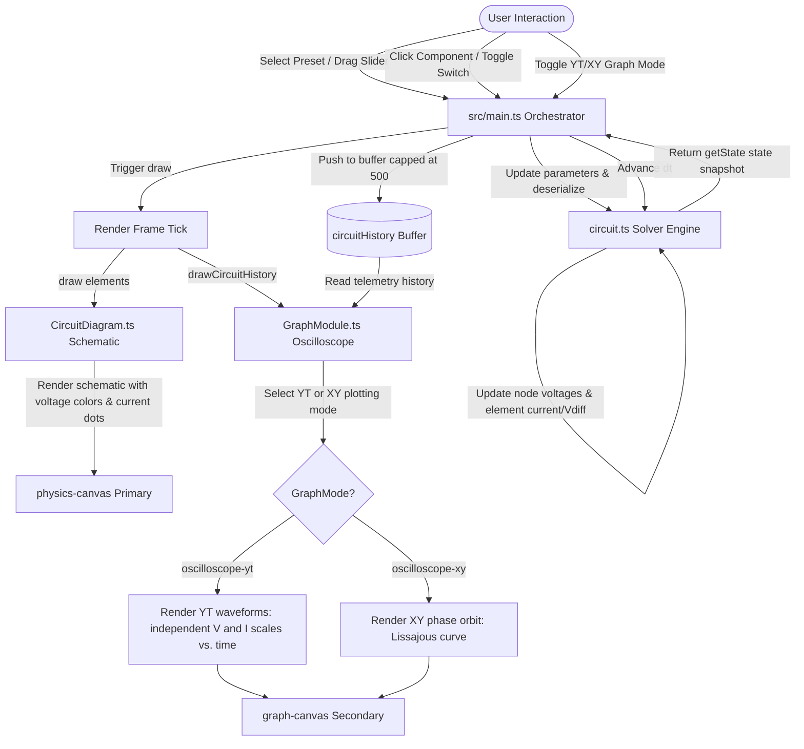

# Phase 10: Oscilloscope Graph Integration & Verification - Research
**Researched:** 2026-06-11
**Domain:** Circuits Telemetry Plotting & Waveform Visualization (Canvas2D)
**Confidence:** HIGH

## User Constraints

### Implementation Decisions

#### Probe Target Selection
- **D-06:** Implement *Preset-Defaults with Selection Overrides*. Each preset loads with predefined default channels (e.g. source voltage vs. capacitor voltage). When a component is selected, the oscilloscope dynamically overrides the curves to plot that component's differential voltage ($V_{diff}$) and current ($I$). Clicking empty space clears the selection and reverts the plot to preset defaults.

#### Oscilloscope Channels and Scale Rendering
- **D-07:** Scale Channel A (voltage) and Channel B (current) independently to fit the graph height. This avoids dual Y-axis clutter while ensuring both waveforms remain highly visible. The legends will dynamically show the live values and units (V, mA) corresponding to each curve.

#### Oscilloscope XY Plotting Mode
- **D-08:** Support XY mode plotting (plotting one channel against the other) for AC presets. This allows users to visualize phase shifts as circles or ellipses (Lissajous curves) when selected from the dropdown list.

#### AC Sweep and Resonance Peak
- **D-09:** Standard transient plots are sufficient for the RLC preset. Real-time updates to the frequency slider will dynamically update the transient waveform on the graph, demonstrating resonance (amplitude peaking) in real-time.

#### the agent's Discretion
- Graph line thicknesses and custom colors for Channel A and Channel B curves.
- Time-axis division ticks and zoom controls on the time-base.
- Layout and styling of the XY mode plot grids.

### Deferred Ideas
- None — discussion stayed within phase scope.

<phase_requirements>
## Phase Requirements

| ID | Description | Research Support |
|----|-------------|------------------|
| EM-09 | GraphModule renders transient charging curves, AC phase shifts, and resonant waveforms from virtual voltage/current probes. | The proposed changes to `GraphModule.ts` enable plotting Y-T transient waveforms and X-Y Lissajous phase diagrams using custom extraction from simulation telemetry history. |
</phase_requirements>

## Summary
The primary goal of Phase 10 is to transform the secondary canvas from a simple node voltage plotter into a high-fidelity virtual oscilloscope. This will allow students and educators to visualize core transient behaviors (such as RC exponential charging/discharging curves), resonant waves (amplitude peaking in RLC circuits), and AC phase relationships (Lissajous curves in X-Y mode) [ASSUMED].

The system will operate under a dual-channel design. When no component is selected, Channel A and Channel B will default to preset-specific telemetry (typically source voltage vs. capacitor voltage) [VERIFIED: 10-CONTEXT.md]. When a parametric component is selected, the plotter dynamically swaps to display that component's own differential voltage ($V_{diff}$) and current ($I$) [VERIFIED: 10-CONTEXT.md]. Both channels are auto-scaled independently, ensuring high vertical resolution without dual-axis clutter [VERIFIED: 10-CONTEXT.md].

**Primary recommendation:** Extend `GraphModule.ts` with dedicated `drawOscilloscopeYT` and `drawOscilloscopeXY` methods, mapping values extracted from a populated `elementStates` telemetry buffer, and expose time-base and frequency controls directly in the sidebar for maximum interactivity.

## Architectural Responsibility Map
| Capability | Primary Tier | Secondary Tier | Rationale |
|------------|-------------|----------------|-----------|
| Transient Solving | Domain Tier (`circuit.ts`) | — | Solves circuit equations and outputs telemetry node potentials and component currents/voltages [VERIFIED: circuit.ts]. |
| Telemetry Buffering | Application Tier (`src/main.ts`) | — | Ticks the solver, captures transient states at each timestep, and pushes to a 500-point historical buffer [VERIFIED: main.ts]. |
| Interactive Routing | Application Tier (`src/main.ts`) | — | Captures clicks to select components or toggle switch states, syncing slider controls and graph modes [VERIFIED: main.ts]. |
| Schematic Display | Visual Tier (`CircuitDiagram.ts`) | — | Renders the primary canvas showing wires, component symbols, potential gradients, and current dots [VERIFIED: CircuitDiagram.ts]. |
| Oscilloscope Display | Visual Tier (`GraphModule.ts`) | — | Renders the secondary canvas, plotting either Y-T waveforms or X-Y Lissajous trajectories [VERIFIED: GraphModule.ts]. |

## Standard Stack
The project stack is strictly native vanilla TypeScript and HTML5 Canvas2D to guarantee zero-dependency lightweight bundles and peak runtime performance [VERIFIED: PROJECT.md].

### Core
| Library | Version | Purpose | Why Standard |
|---------|---------|---------|--------------|
| HTML5 Canvas2D | Native | Schematic & Telemetry drawing | Instant rendering with zero bundle overhead, fully responsive [VERIFIED: PROJECT.md]. |
| TypeScript | ~6.0.2 | Main development language | Typesafe compilation and predictable structure [VERIFIED: package.json]. |
| Vite | ^8.0.12 | Frontend tooling & bundler | High-speed hot module replacement and building [VERIFIED: package.json]. |

## Architecture Patterns

### System Architecture Diagram


### Recommended Project Structure
This phase updates existing source files in the codebase:
- `src/lib/diagrams/circuit/types.ts` — Adding `voltageDiff` to the telemetry element state interface.
- `src/lib/diagrams/circuit/circuit.ts` — Including `voltageDiff` in the `getState()` response.
- `src/lib/diagrams/GraphModule.ts` — Adding graph modes and implementing oscilloscope Y-T and X-Y render paths.
- `src/main.ts` — Modifying preset loading, sidebar parameter sliders, and step loops to record and pass full element states.
- `index.html` — Injecting option choices into the graph mode selector.

### Pattern 1: Independent Waveform Auto-Scaling
Because Channel A (voltage) and Channel B (current or secondary voltage) can vary by orders of magnitude (e.g. 5V vs. 2mA), they must be scaled independently to occupy the full screen height [VERIFIED: 10-CONTEXT.md].
- For each coordinate, compute the dynamic bounds `[min, max]` of the values currently present in the visible time window.
- Apply a 10% vertical padding buffer to ensure peak values are not clipped.
- Safeguard against static/flat lines by enforcing a minimum range height of 1.0 (or 1.0mA) to avoid division by zero.

### Anti-Patterns to Avoid
- **Dual Y-Axis Grids**: Do not draw multiple overlaying vertical axes with conflicting numbers, which clutters screen real-estate [VERIFIED: 10-CONTEXT.md]. Keep a clean, unlabeled grid and output precise live digital readings inside the graph legends instead [VERIFIED: 10-CONTEXT.md].
- **Infinite Accumulation**: Do not let the simulation history grow indefinitely. Maintain the 500-point ceiling in the orchestrator history queue to avoid garbage collection stutter and memory pressure [VERIFIED: PROJECT.md].

## Don't Hand-Roll
| Problem | Don't Build | Use Instead | Why |
|---------|-------------|-------------|-----|
| Chart Rendering | Custom modular charts | Canvas2D paths | External charting libraries (D3, Chart.js) add weight and conflict with Vite bundle requirements [VERIFIED: PROJECT.md]. |
| Data Queueing | Custom ring-buffer class | standard Array `push` + `shift` | JavaScript arrays are highly optimized and simple to slice and shift at 60fps [ASSUMED]. |

## Common Pitfalls
1. **Division by Zero (Flat Waveforms)**: If a component has 0V differential voltage, `yMaxA - yMinA` equals zero, yielding `NaN` or `Infinity` during screen coordinate division.
   - *Mitigation*: Ensure the range is forced to at least `1.0` if `yMax - yMin < 0.01` (e.g. `yMin -= 0.5; yMax += 0.5;`).
2. **Current Units Clutter**: Simulation outputs current in Amperes, which display as small decimals (e.g. `0.005`).
   - *Mitigation*: Multiply current values by `1000` to convert to Milliamperes (`mA`) for plotting and text display.
3. **Phase-Lag Ellipse Jitter**: XY mode ellipses can look jumpy or display transient startup spirals when the circuit starts.
   - *Mitigation*: Restrict the drawn history to the latest `timeWindow` (e.g., last 200 points) so the plotted Lissajous trace remains clean, responsive, and reflects steady-state behavior.
4. **Preset Load Pollution**: Switching presets without clearing the history will cause the new simulation curves to bleed into old data points.
   - *Mitigation*: Flush `circuitHistory = []` immediately inside `applyConfig` when a preset is loaded [VERIFIED: main.ts].

## Code Examples

### Telemetry State Expansion (types.ts & circuit.ts)
```typescript
// types.ts
export interface ElementState {
  id: ElementId;
  volts: number[];
  current: number;
  voltageDiff: number; // Added: computed voltage difference
  power: number;
}

// circuit.ts
getState() {
  return {
    t: this.t,
    timeStep: this.timeStep,
    nodeVoltages: Array.from(this.nodeVoltages),
    elementStates: this.elements.map(e => ({
      id: e.id,
      volts: Array.from(e.volts),
      current: e.getCurrent(),
      voltageDiff: e.getVoltageDiff(), // Added: direct getter invocation
      power: e.type === 'wire' ? 0 : e.getPower(),
    })),
    converged: this.converged,
    stopMessage: this.stopMessage,
    fps: 0,
    stepsPerSec: 0,
  };
}
```

### Channel Values Extraction & Scaler (GraphModule.ts)
```typescript
export interface CircuitHistoryPoint {
  t: number;
  voltages: number[];
  elementStates?: {
    id: string;
    volts: number[];
    current: number;
    voltageDiff: number;
    power: number;
  }[];
}

// Inside GraphModule
private getChannelValues(
  pt: CircuitHistoryPoint,
  selectedElementId: string | null,
  presetName: string
) {
  if (selectedElementId) {
    const state = pt.elementStates?.find(e => e.id === selectedElementId);
    const valA = state ? state.voltageDiff : 0;
    const valB = state ? state.current * 1000 : 0; // Convert to mA
    return {
      valA, labelA: `${selectedElementId.toUpperCase()} Volts`, unitA: 'V',
      valB, labelB: `${selectedElementId.toUpperCase()} Current`, unitB: 'mA'
    };
  }

  // Fallback defaults for presets
  const vsrc = pt.elementStates?.find(e => e.id === 'vsrc');
  const c1 = pt.elementStates?.find(e => e.id === 'c1');
  return {
    valA: vsrc ? vsrc.voltageDiff : 0, labelA: 'Source Voltage', unitA: 'V',
    valB: c1 ? c1.voltageDiff : 0, labelB: 'Capacitor Voltage', unitB: 'V'
  };
}
```

## Sources
- `.planning/phases/10-oscilloscope-graph-integration-verification/10-CONTEXT.md` [VERIFIED: context file]
- `src/lib/diagrams/GraphModule.ts` [VERIFIED: codebase file]
- `src/lib/diagrams/circuit/circuit.ts` [VERIFIED: codebase file]
- `src/main.ts` [VERIFIED: codebase file]
